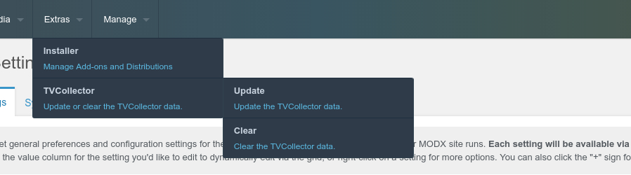

# TVCollector

This MODx extension will help you quickly access additional fields and greatly improve the performance of your site.


---


### To display the current resource field, use:
```
[[+tvc.tv1]]
[[+tvc.tv2]]
[[+tvc.tv3]]
...
```

**tv1** - this is the name of the additional field.


---


### To display the required field with getResources, use:
```
[[getResources?
  &parents=`0`
  &tpl=`@INLINE [[+properties.tvc.tv1]] [[+properties.tvc.tv2]] [[+properties.tvc.tv3]]`
]]
```

or in chunk:
```
[[+properties.tvc.tv1]]
[[+properties.tvc.tv2]]
[[+properties.tvc.tv3]]
...
```
It does not need to include additional fields for getResources, this will greatly speed up the selection.


---


### To display the required field with fastField, use:
```
[[#1.prop.tvc.tv1]]
[[#1.prop.tvc.tv2]]
[[#1.prop.tvc.tv3]]
...
```


---


If you installed this extension on an old site, or programmatically changed additional fields, or simply want to update all data, just click this menu item and wait for the data to be updated.

